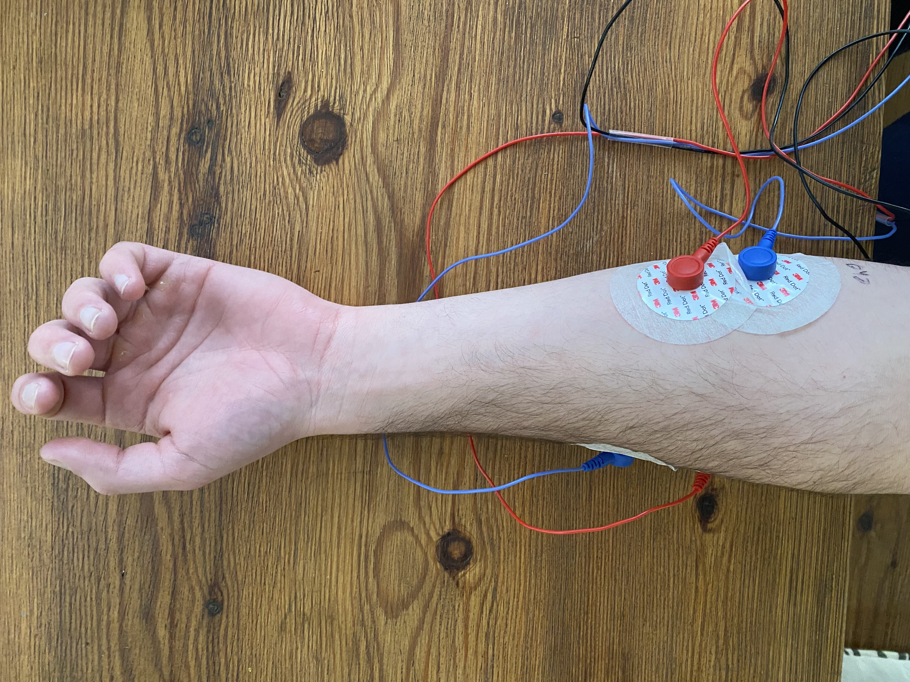
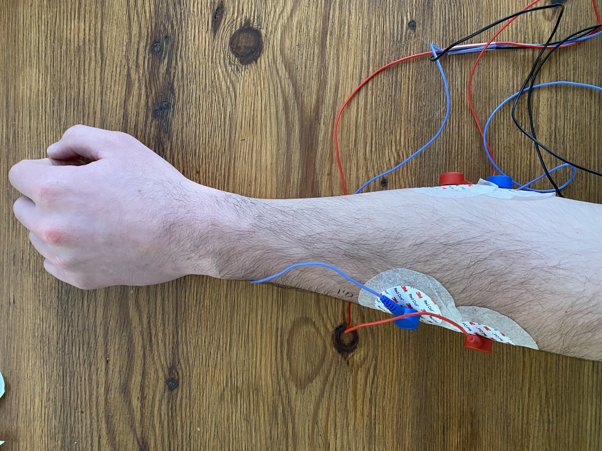

# EMG Gesture Classification Dataset

This repository contains a dataset collected for a project on **EMG-based hand gesture classification**, where muscle activity from the forearm was recorded using surface electrodes.

---

## Dataset Structure

EMG_data contains raw data that is unevenly sampled data at an average of 4700 HZ

EMG_data_rectified has all data resampled evenly at 4700 Hz

Each contains 6 trial folders. Each trial folder contains `.txt` files named after the gesture being performed (e.g., `rest0.txt`, `handlexion2.txt`, etc.). Each file holds a single gesture recording lasting 5 seconds.

---

## 🧠 Signal Acquisition

- **Channels:** 2 EMG electrodes, 1 reference per channel
- **Sampling Frequency:** 4700 Hz
- **Hardware:** Raspberry Pi + MCP3008 ADC + [Grove - EMG Detector](https://wiki.seeedstudio.com/Grove-EMG_Detector/)
- **Electrode Placement:**

---

## Gestures

There are 10 defined gestures, shown in the following order from the top left:
- Rest
- Fist
- Finger Extension
- Finger Spread
- Hand Flexion
- Hand Extension
- Second Digit Flexion
- Third Digit Flexion
- Fourth Digit Flexion
- Fifth Digit Flexion


Note: The last 4 gestures are only available for Trial 1.

---

## Data Format

Each `.txt` file is a time series with the following structure:
```
<timestamp> <emg_channel_1> <emg_channel_2>
0 0.012 0.014
0.0002 0.013 0.013
```
...
